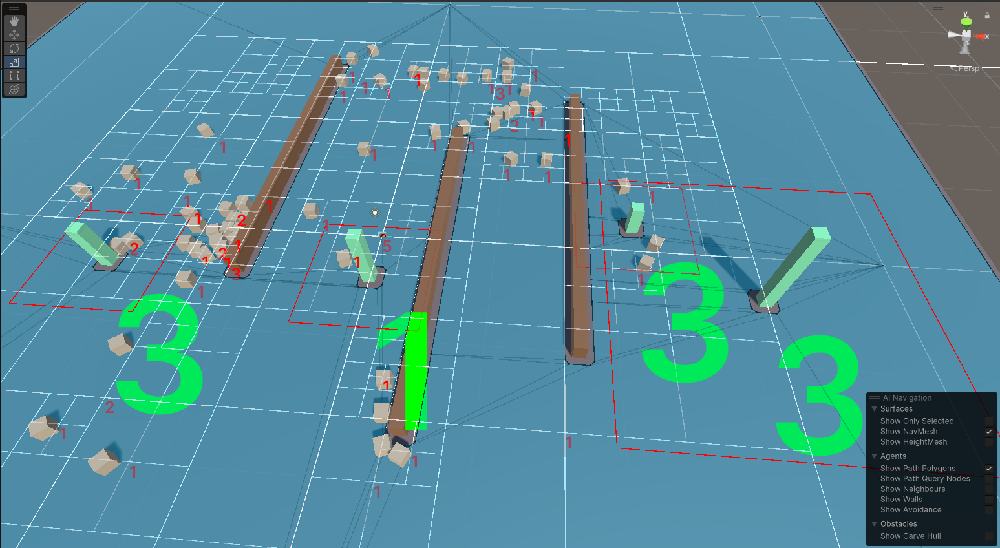
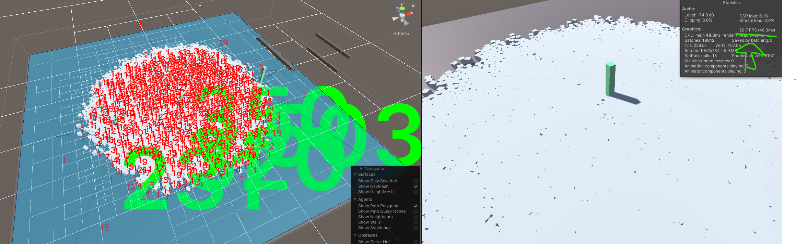

# Quad Tree Experimentation

Problem: Calculating distances between things is expensive. Lets say we have 10 towers (n) and 1000 zombies (m) charging toward them. For turrets to know which zombies are closest, we might calculate the distances between all turrets and all zombies, but thats exremely expensive (m*n distance calculations).

Approach: This project demonstrates the use of a Quad Tree to simplify the detection. The Quad Tree figures out which targets are "roughly in range" of a tower, and once we have that list, we can do the more expensive vector distance calculations to determine which target is closest to the tower.

<video src="20231120-0040-53.2402874.mp4" controls title="Title"></video>
<video src="demo.mp4" controls title="Title"></video>

## Image Example

- After you hit 'play' the grey squares will pathfind to random positions
- As they move around, the white grid will update, displaying the state of the quad tree data structure
- Red numbers show how many objects are in a given quad
- Green numbers represent the number of objects "in range" of a tower
- Within each red boundary, we can know in constant time how many enemies are present. 

## In Practice

Looking at the image, you can see the two towers on the right each see 3 enemies. If each tower needs to pick a single target, we only need to perform calculations between the 2 towers and the 3 targets (2x3 instead of m*n). We could apply decision logic, such as targeting the strongest enemy, closest enemy, or furthest enemy, and it would still be super fast because its only considering the things that are already known to be in the same quad boundaries. 

## Video Demo
I haven't found an easy way to add a video in a readme, but if you want to see it in action, you can download this 15 second mp4.
https://github.com/EvanDaley/QuadTree_RTS_Pathfinding/blob/main/demo.mp4

## Rough benchmarking

I tested it with a mid-range PC and got the following results, running in the editor
- 200 pathfinding game objects: ~100 fps
- 3000 pathfinding game objects: ~45 fps
- 8000 pathfinding game objects: ~15 fps

On a higher end PC I was able to have 8000 actors at around 30 fps (or 20 FPS with both editor and game windows rendering):

